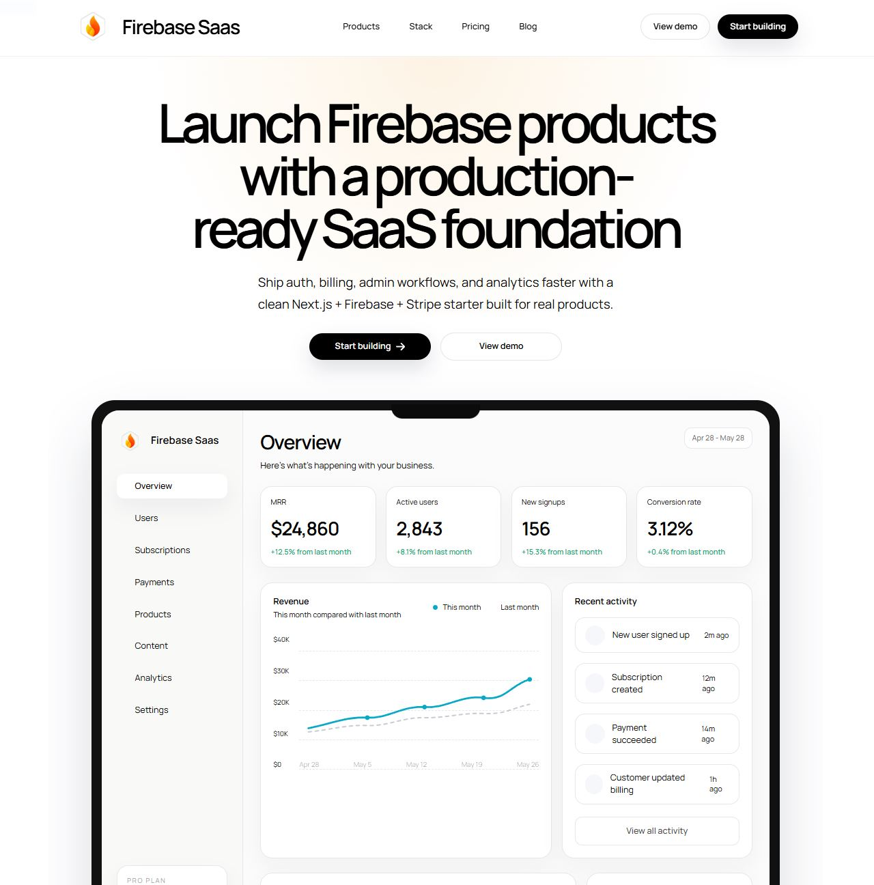

<p align="center">
  
</p>

<h1 align="center">Firebase Saas Template</h1>

<p align="center">
  A production-grade Next.js starter for shipping SaaS products with Firebase, Stripe, polished auth flows, a premium marketing site, and an operator-friendly dashboard.
</p>

<p align="center">
  Next.js 14 - React 18 - Firebase - Stripe - Tailwind CSS - shadcn/ui-style patterns - MDX
</p>

## Overview

Firebase Saas Template is built for teams that want to launch faster without starting from a blank canvas. It gives you a clean product website, authentication flows, billing primitives, dashboard surfaces, and content scaffolding you can adapt into a real SaaS.

The template is designed to feel product-ready out of the box rather than like a barebones boilerplate. Marketing pages, auth screens, and the in-app dashboard all share the same visual system so you can move from setup to customization quickly.

## What You Get

- A premium landing page with a strong hero, product mockup, feature storytelling, and conversion-focused calls to action
- Firebase Authentication flows for sign in, sign up, password reset, and user session handling
- Stripe billing foundations for subscriptions, customer management, checkout flows, and billing portal support
- A polished SaaS dashboard with revenue, customer, activity, and operational overview surfaces
- Admin and operator-focused UI patterns for managing plans, users, and growth workflows
- MDX-powered blog and content sections for shipping docs, posts, and resources
- Analytics hooks and Mixpanel integration points for product events
- Responsive layouts across marketing, auth, and dashboard experiences

## Core Product Areas

### Marketing Site

- Editorial homepage with a product-style hero and dashboard preview
- Feature sections for auth, billing, admin, analytics, and content
- Clean brand system built around the Firebase Saas identity

### Authentication

- Email/password sign in and sign up
- Password reset flow
- Social sign-in UI patterns and Firebase-ready auth handling
- Auth pages built with a more premium split-screen product presentation

### SaaS Dashboard

- KPI cards for MRR, customers, payments, and readiness
- Revenue charting and recent activity views
- Subscription mix, launch checklist, and team access panels
- Preview-friendly behavior when full backend config is not available yet

### Billing and Operations

- Stripe customer portal helpers
- Product and subscription fetching utilities
- Server-side Firebase Admin hooks for protected workflows

## Tech Stack

- `Next.js 14` with the App Router
- `React 18`
- `TypeScript`
- `Firebase` for auth and server-side admin integration
- `Stripe` for billing and subscription workflows
- `Tailwind CSS` for styling
- `Font Awesome` and custom product UI iconography
- `MDX` for blog/content authoring
- `SWR`, `react-hot-toast`, and supporting app utilities

## Project Structure

```text
src/app            App Router pages, API routes, route layouts
src/components     Marketing, auth, dashboard, nav, shared UI
src/lib            Firebase, Stripe, auth, site config, utilities
public             Brand assets and public images
docs               README screenshots and repo-facing media
```

## Quick Start

1. Clone the repository.
2. Install dependencies with `yarn install`.
3. Copy `.env.example` to `.env.local` and fill in your Firebase and Stripe credentials.
4. Start the development server with `yarn dev`.
5. Open [http://localhost:3000](http://localhost:3000).

## Environment Variables

Create a `.env.local` file using the included `.env.example` as your starting point.

```bash
NEXT_PUBLIC_SITE_URL=http://localhost:3000
NEXT_PUBLIC_ENABLE_BLOG=true
NEXT_PUBLIC_MIXPANEL_TOKEN=

NEXT_PUBLIC_FIREBASE_API_KEY=
NEXT_PUBLIC_FIREBASE_AUTH_DOMAIN=
NEXT_PUBLIC_FIREBASE_PROJECT_ID=
NEXT_PUBLIC_FIREBASE_STORAGE_BUCKET=
NEXT_PUBLIC_FIREBASE_MESSAGING_SENDER_ID=
NEXT_PUBLIC_FIREBASE_APP_ID=
NEXT_PUBLIC_FIREBASE_MEASUREMENT_ID=

FIREBASE_CLIENT_EMAIL=
FIREBASE_PRIVATE_KEY=

NEXT_PUBLIC_STRIPE_PUBLISHABLE_KEY=
STRIPE_SECRET_KEY=

CONTENTFUL_REVALIDATE_SECRET=
```

## Recommended Setup Flow

1. Configure your Firebase project and enable the auth providers you want to support.
2. Add your Firebase web app credentials and admin service credentials.
3. Connect Stripe keys and map your products or plans.
4. Customize marketing copy, pricing, and dashboard modules for your SaaS.
5. Wire analytics, events, and product-specific data models.

## Included Routes

- `/` marketing homepage
- `/login` sign in
- `/signup` account creation
- `/password-reset` password recovery
- `/app/dashboard` product dashboard
- `/blog` content and publishing surface
- `/admin` admin tools

## Deployment

Firebase Saas Template is a strong fit for Vercel or any Node-compatible deployment target that supports Next.js. Before going live:

- set all production environment variables
- verify Stripe keys and return URLs
- confirm Firebase Admin credentials are available server-side
- review analytics, revalidation, and auth provider settings

## Who This Is For

- founders shipping a new SaaS MVP
- agencies building client SaaS products
- indie makers who want a premium starter instead of a blank stack
- product teams replacing boilerplate with a cleaner foundation

## License

This project is licensed under the terms of the [LICENSE](./LICENSE).
